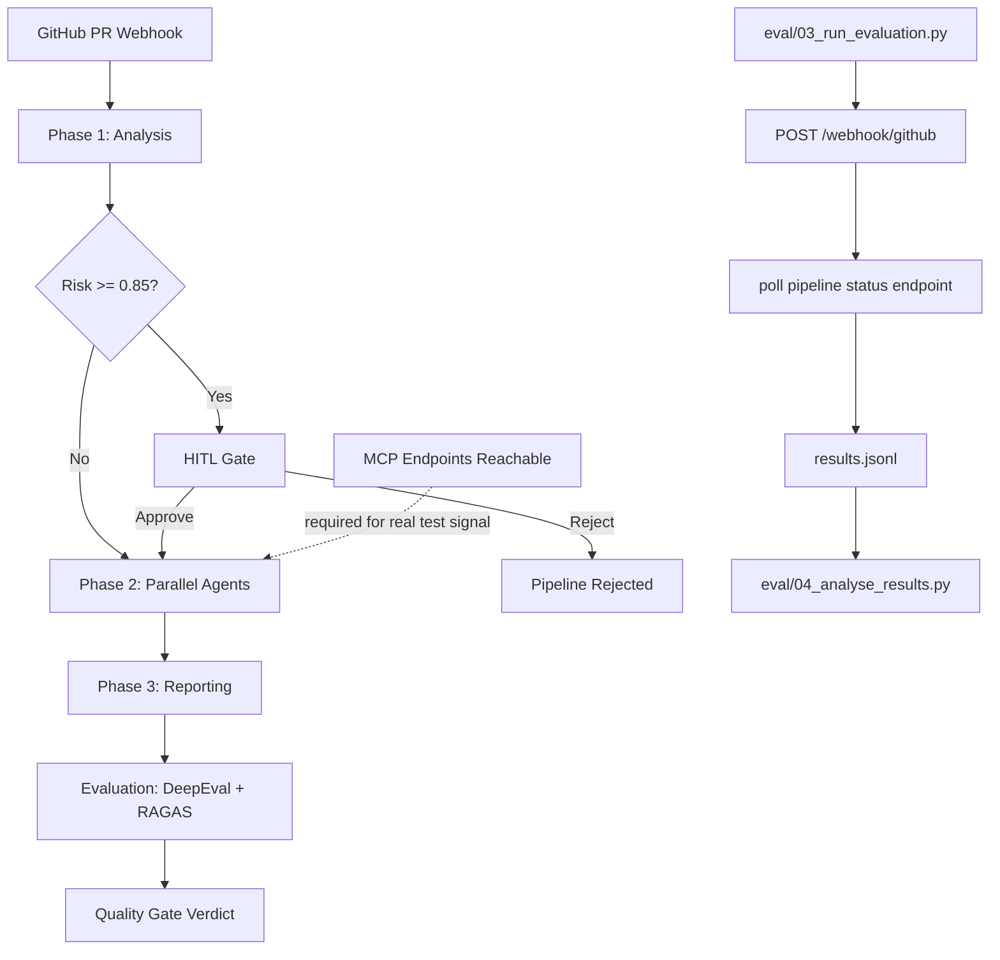

# K11tech Agentic AI QA System

[](https://doi.org/10.5281/zenodo.20543872)
[](LICENSE)
[](https://www.python.org/)

A production-grade, LangGraph-native CI/CD quality pipeline: **14 specialist agents**, **7 MCP servers**, parallel execution, HITL approval gates, LangSmith observability, and DeepEval + RAGAS quality evaluation — triggered on every pull request.

> **Research Paper:** Jadhav, K. (2026). *Autonomous CI/CD Quality Assurance Using LangGraph Multi-Agent Orchestration and Risk-Proportionate Human-in-the-Loop Control.* Zenodo. https://doi.org/10.5281/zenodo.20543872

---

## Architecture

```
GitHub PR Webhook
        │
        ▼
┌───────────────────────────────────────────────────────────────────┐
│  PHASE 1 — Analysis (LangGraph subgraph)                          │
│  ┌─────────────────────┐   ┌──────────────────────────┐          │
│  │ fetch_pr_context     │   │ retrieve_knowledge        │          │
│  │ (GitHub MCP)         │   │ (Knowledge Store MCP)    │          │
│  └──────────┬──────────┘   └────────────┬─────────────┘          │
│             └──────────────┬────────────┘                         │
│                            ▼                                       │
│                      score_risk (LLM)                             │
│                            │                                       │
│                     generate_test_plan (LLM)                      │
└────────────────────────────┬──────────────────────────────────────┘
                             │
             ┌───────────────▼───────────────┐
             │  HITL Gate (risk ≥ 0.85)      │
             │  interrupt() → Slack alert    │
             │  resume via /api/hitl/decision│
             └───────────────┬───────────────┘
                             │ approve
┌────────────────────────────▼──────────────────────────────────────┐
│  PHASE 2 — Parallel Agent Execution (Send API)                    │
│                                                                    │
│  api_agent       playwright_agent    perf_agent    security_agent │
│  (GitHub MCP)    (Playwright MCP)    (k6 MCP)      (GitHub MCP)   │
│                                                                    │
│  data_agent      browser_agent       a11y_agent    regression_agent│
│  (Postgres MCP)  (Playwright MCP)    (Playwright)  (GitHub MCP)   │
│                                                                    │
│  All write to state via operator.add reducers — no conflicts      │
└────────────────────────────┬──────────────────────────────────────┘
                             │
┌────────────────────────────▼──────────────────────────────────────┐
│  PHASE 3 — Reporting                                              │
│  aggregate_results → generate_report (gpt-4o) + file_jira_tickets│
│                    → send_slack_report                            │
└────────────────────────────┬──────────────────────────────────────┘
                             │
┌────────────────────────────▼──────────────────────────────────────┐
│  EVALUATION — Quality Gate (DeepEval + RAGAS, parallel)           │
│  deepeval_node (faithfulness, relevancy) ─┐                       │
│                                            ├─▶ aggregate → gate   │
│  ragas_node (context precision/recall)   ─┘                       │
└───────────────────────────────────────────────────────────────────┘
```



Evaluation harness path (used by empirical runs in eval/):

```text
eval/03_run_evaluation.py
  -> POST /webhook/github (pull_request payload)
  -> poll /api/pipeline/{run_id}/status until verdict is available
  -> append JSONL result row (verdict, duration, classification inputs)
  -> eval/04_analyse_results.py computes RQ1-RQ4 metrics
```

Important runtime dependency:

- Phase 2 depends on reachable MCP endpoints.
- If MCP services are unavailable, agent execution can fail and produce limited/no test signal.
- In that case, verdicts are fail-closed and evaluation metrics should be interpreted as infrastructure-limited rather than model-quality-limited.

---

## Project Structure

```
k11techlab-agentic-ai-qa-system/
├── agents/                # specialist agent implementations used by pipeline phases
├── api/
│   └── webhook.py         # FastAPI: GitHub webhook + HITL + status endpoints
├── docs/                  # architecture, quickstart, and agent docs
├── eval/
│   ├── 00_scaffold_repos.py
│   ├── 01_collect_dataset.py
│   ├── 02_label_dataset.py
│   ├── 03_run_evaluation.py
│   ├── 04_analyse_results.py
│   └── data/              # dataset, labels, and evaluation outputs
├── mcps/                  # typed MCP HTTP client wrappers used by pipeline nodes
├── pipeline/
│   ├── __init__.py          # public API: run_pipeline, submit_hitl_decision
│   ├── state.py             # CIPipelineState TypedDict + initial_state()
│   ├── phase1.py            # Analysis subgraph (4 nodes)
│   ├── phase2.py            # 8-agent parallel dispatch subgraph
│   ├── phase3.py            # Aggregation & reporting subgraph
│   ├── evaluation.py        # DeepEval + RAGAS evaluation subgraph
│   ├── hitl.py              # HITL gate nodes + routing
│   ├── orchestrator.py      # Main ci_builder StateGraph
│   ├── runner.py            # run_pipeline(), stream_pipeline(), submit_hitl_decision()
│   └── mcp_clients.py       # MCPClient wrappers for all 7 servers
├── tests/
│   ├── conftest.py          # shared fixtures
│   ├── unit/                # node-level tests with mocked LLMs/MCPs
│   ├── integration/         # subgraph tests with MemorySaver
│   └── e2e/                 # full pipeline smoke tests
├── docker-compose.yml       # orchestrates webhook + MCP server containers
├── Dockerfile
├── requirements.txt
├── .env.example
├── checkpoints.db           # SQLite checkpoint store (runtime-generated)
└── README.md
```

Note: This repository includes MCP client wrappers in mcps/. MCP server implementations referenced by docker-compose.yml are expected from external service folders or running endpoints.

---

## Quick Start

### 1. Install dependencies

```bash
python -m venv .venv
source .venv/bin/activate          # Windows: .venv\Scripts\activate
pip install -r requirements.txt
```

### 2. Configure environment

```bash
cp .env.example .env
# Edit .env — set OPENAI_API_KEY, GITHUB_TOKEN, and MCP server URLs
```

### 3. Start MCP servers

The webhook depends on all MCP servers being reachable. You can either:

- Start the full stack via Docker Compose (recommended), or
- Point env vars (`GITHUB_MCP_URL`, `PLAYWRIGHT_MCP_URL`, etc.) to already-running MCP endpoints.

Recommended:

```bash
docker compose up -d
docker compose ps
```

### 4. Start the webhook server

```bash
uvicorn api.webhook:app --host 0.0.0.0 --port 9000 --reload
```

### 5. Run the pipeline programmatically

```python
import asyncio
from pipeline import run_pipeline

async def main():
    result = await run_pipeline(
        pr_number=42,
        repo_name="myorg/myrepo",
        pr_diff=open("my_pr.diff").read(),
    )
    print(f"Verdict: {result['summary']['verdict']}")
    print(f"Defects: {result['summary']['defect_count']}")
    print(f"Eval passed: {result['eval_passed']}")

asyncio.run(main())
```

---

## The 14 Agents

| # | Agent | MCP Server | Responsibility |
|---|-------|-----------|----------------|
| 1 | fetch_pr_context | GitHub MCP | Fetch changed files & commit metadata |
| 2 | retrieve_knowledge | Knowledge Store MCP | Retrieve relevant documentation |
| 3 | score_risk | LLM (gpt-4o-mini) | Assess PR risk score 0.0–1.0 |
| 4 | generate_test_plan | LLM (gpt-4o-mini) | Produce structured test plan |
| 5 | api_agent | GitHub MCP | API contract & endpoint testing |
| 6 | playwright_agent | Playwright MCP | E2E browser automation (Chromium) |
| 7 | perf_agent | k6 MCP | Load & performance testing |
| 8 | security_agent | GitHub MCP | Code scanning: SQLi, XSS, secret leak |
| 9 | data_agent | Postgres MCP | Data integrity & migration validation |
| 10 | browser_agent | Playwright MCP | Cross-browser (Chromium, Firefox, WebKit) |
| 11 | a11y_agent | Playwright MCP | WCAG AA accessibility audit |
| 12 | regression_agent | GitHub MCP | Regression suite against base branch |
| 13 | generate_report | LLM (gpt-4o) | Markdown CI report synthesis |
| 14 | file_jira_tickets | Jira MCP | Auto-create Jira issues for critical defects |

---

## The 7 MCP Servers

| MCP Server | Port | Purpose |
|-----------|------|---------|
| `github_mcp` | 8001 | PR files, code scanning, regression runs |
| `playwright_mcp` | 8002 | Browser automation, E2E, a11y audits |
| `k6_mcp` | 8003 | Load test execution |
| `jira_mcp` | 8004 | Issue creation and tracking |
| `postgres_mcp` | 8005 | Database validation and test result storage |
| `slack_mcp` | 8006 | Notifications and HITL alerts |
| `knowledge_store_mcp` | 8007 | Documentation retrieval for test planning |

---

## HITL Approval Flow

When `risk_score >= 0.85`, the pipeline pauses and notifies `#qa-alerts`:

```
:rotating_light: High-risk PR requires review
Repo: org/repo | PR: #42
Risk score: 0.91 | Factors: auth change, sql injection risk
/qa-approve <run_id>   or   /qa-reject <run_id> <reason>
```

Resume via Slack slash command or REST API:

```bash
curl -X POST http://localhost:9000/api/hitl/decision \
  -H "Content-Type: application/json" \
  -d '{"run_id":"<id>","decision":"approve","reviewer":"qa-lead","comment":"Reviewed auth changes"}'
```

---

## Evaluation Harness Notes (June 2026)

- `eval/03_run_evaluation.py` now posts a valid `pull_request` webhook event and polls `/api/pipeline/{run_id}/status` until a verdict is available.
- Classification logic treats `FAIL`, `BLOCK`, `NEEDS_REVIEW`, and `REJECT` as flagged outcomes.
- `pipeline/phase3.py` now stores `verdict_reason` and uses fail-closed behavior when no tests run because agents fail (`agent_execution_failed_no_test_signal`).
- If MCP endpoints are down/unreachable, Phase 2 can produce no test signal; in that case quality metrics are not meaningful until MCP connectivity is restored.

---

## Quality Gates

The evaluation subgraph runs after Phase 3 and scores:

| Metric | Tool | Threshold |
|--------|------|-----------|
| Answer Relevancy | DeepEval | ≥ 0.70 |
| Faithfulness | DeepEval | ≥ 0.80 |
| Context Precision | RAGAS | ≥ 0.55 |
| RAGAS Faithfulness | RAGAS | ≥ 0.75 |

If any threshold is not met, `eval_passed=False` and the GitHub Actions step exits with code 1, blocking merge.

---

## GitHub Actions Integration

```yaml
# .github/workflows/agentic-qa.yml
on:
  pull_request:
    types: [opened, synchronize, reopened]

jobs:
  agentic-qa:
    runs-on: ubuntu-latest
    steps:
      - uses: actions/checkout@v4
      - uses: actions/setup-python@v5
        with: {python-version: "3.11"}
      - run: pip install -r requirements.txt
      - name: Run Agentic QA Pipeline
        env:
          OPENAI_API_KEY: ${{ secrets.OPENAI_API_KEY }}
          LANGSMITH_API_KEY: ${{ secrets.LANGSMITH_API_KEY }}
          LANGCHAIN_TRACING_V2: "true"
          GITHUB_TOKEN: ${{ secrets.GITHUB_TOKEN }}
        run: |
          python -c "
          import asyncio, os, sys
          from pipeline import run_pipeline
          result = asyncio.run(run_pipeline(
              pr_number=int('${{ github.event.pull_request.number }}'),
              repo_name='${{ github.repository }}',
              pr_diff=open('pr.diff').read() if os.path.exists('pr.diff') else '',
          ))
          sys.exit(0 if result.get('eval_passed', True) else 1)
          "
```

---

## Running Tests

```bash
pytest tests/unit/          # fast, no external deps
pytest tests/integration/   # requires langgraph + MemorySaver
pytest tests/e2e/           # mocked full pipeline
pytest                      # all tests
```

---

## License

This project is licensed under the Apache License 2.0. See [LICENSE](LICENSE).

---

---

## Citation

If you use this work, please cite:

Jadhav, K. (2026). Autonomous CI/CD Quality Assurance Using LangGraph Multi-Agent Orchestration and Risk-Proportionate Human-in-the-Loop Control. Zenodo. https://doi.org/10.5281/zenodo.20543872

```bibtex
@misc{jadhav2026autonomous,
  title     = {Autonomous CI/CD Quality Assurance Using LangGraph Multi-Agent Orchestration and Risk-Proportionate Human-in-the-Loop Control},
  author    = {Kavita Jadhav},
  year      = {2026},
  publisher = {Zenodo},
  doi       = {10.5281/zenodo.20543872},
  url       = {https://doi.org/10.5281/zenodo.20543872}
}
```

---

*K11tech Agentic AI QA System · kavita.jadhav@k11softwaresolutions.com*
